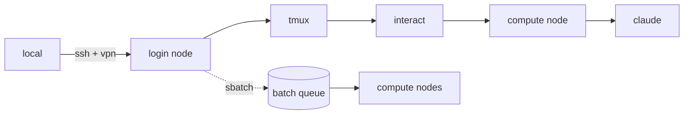

---
hide:
  - navigation
  - toc
---

<pre class="hero-ascii">
sapelo2-boilerplate
───────────────────
notes, sbatch scripts, and Claude Code rules for running work on
UGA's HPC cluster. written from things that broke first.
</pre>

## Start here

- [Getting started](getting-started.md) — Sapelo2 from zero: SSH, storage, `interact`, sbatch.
- [Claude Code setup](claude-code/index.md) — the `CLAUDE.md` ruleset I run, and why.
- [CLAUDE.md ruleset](claude-code/rules.md) — the raw rules.
- [sbatch templates](reference/sbatch.md) · [Storage topology](reference/storage.md)

## Conventions

- Job I/O in `/scratch/$USER/`. Never `/home`. `/scratch` purges at 30 days.
- Inside sbatch: `source activate env`, never `conda activate`. Fresh sbatch shells have no conda init.
- GPUs: L4 (24 GB) before A100 (80 GB) unless the model needs it. L4s are almost always idle.

Rationale + failure modes: [the ruleset](claude-code/rules.md).

## Session architecture

Claude Code's bash runs wherever the shell that launched it runs. Login node = your commands hit the login node. `interact` first, then `claude`.

## What's universal vs cluster-specific

Most of this is GACRC-specific (partitions, QOS, module names, `/work/<lab>`). Portable parts:

- Post-submission health check (15–30 s after `sbatch`)
- Many small jobs over one large one
- `source activate` vs `conda activate` in batch shells
- Embedding pipeline sanity checks (shape, pairwise correlation, dead dims)
- Reuse-and-resume pipeline design

Universal agentic research practices (skills, session hygiene, cowork conventions): [agentic-research-toolkit](https://github.com/ChenHsieh/agentic-research-toolkit).

---

Source: [github.com/ChenHsieh/sapelo2-boilerplate](https://github.com/ChenHsieh/sapelo2-boilerplate)
