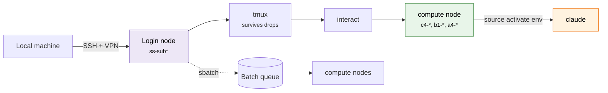
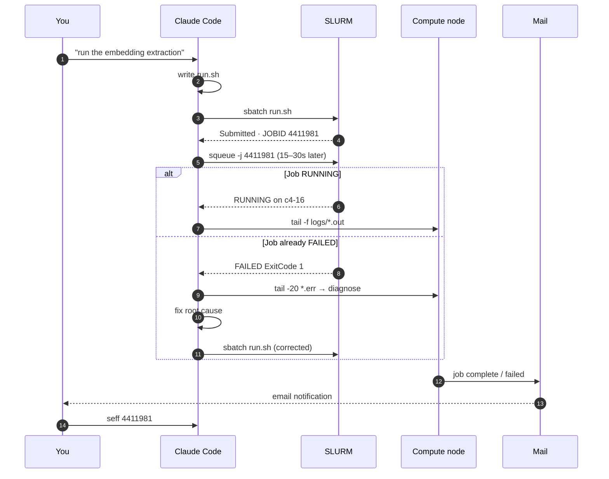

---
hide:
  - navigation
  - toc
---

<pre class="hero-ascii">
███████╗ █████╗ ██████╗ ███████╗██╗      ██████╗ ██████╗ 
██╔════╝██╔══██╗██╔══██╗██╔════╝██║     ██╔═══██╗╚════██╗
███████╗███████║██████╔╝█████╗  ██║     ██║   ██║ █████╔╝
╚════██║██╔══██║██╔═══╝ ██╔══╝  ██║     ██║   ██║██╔═══╝ 
███████║██║  ██║██║     ███████╗███████╗╚██████╔╝███████╗
╚══════╝╚═╝  ╚═╝╚═╝     ╚══════╝╚══════╝ ╚═════╝ ╚══════╝
    B O I L E R P L A T E · U G A   G A C R C   H P C
</pre>

Battle-tested scripts, agent rules, and pipelines for running real work on <a href="https://wiki.gacrc.uga.edu">GACRC Sapelo2</a> — UGA's shared HPC cluster. Opinionated. Cluster-aware. Written from things that broke first.

-   :material-rocket-launch-outline: __Getting started__

    ---

    Sapelo2 from zero: SSH clients, storage model, `interact`, sbatch basics, Claude Code on shared HPC. Updated 2026.

    [:octicons-arrow-right-24: Start here](getting-started.md)

-   :material-robot-outline: __Claude Code setup__

    ---

    The ruleset, permission allowlist, and jq-free statusline I actually run — plus the reasoning behind each rule.

    [:octicons-arrow-right-24: Claude Code](claude-code/index.md)

-   :material-dna: __Tool recipes__

    ---

    sbatch scripts + notes for alphaFold, BUSCO, OrthoFinder, nf-core/rnaseq, OmegaFold, SpeedPPI, Trinotate, MCScanX.

    [:octicons-arrow-right-24: Recipes](recipes/index.md)

-   :material-pipe: __Pipelines__

    ---

    Snakemake pipelines: YouTube → Whisper transcription, and cross-species DIAMOND best-hit annotation.

    [:octicons-arrow-right-24: Pipelines](pipelines/index.md)

## Session architecture

Claude Code's bash tool runs wherever the shell that launched it runs. Launch it on the login node and every command hits the login node. Launch it inside an `interact` session and it gets real compute. The cluster doesn't care that you're using a fancy AI tool — same rules apply.

## Job lifecycle

The post-submission health check (step 4) is mandatory — it catches the 90% of failures that happen in the first 10 seconds (wrong module version, missing path, `conda activate` in sbatch).

## Conventions

!!! tip "One rule, everywhere"
    Job I/O lands in `/scratch/$USER/`, never `/home`. `/scratch` has no quota but purges every 30 days.

!!! warning "sbatch footgun"
    In sbatch scripts use `source activate env`, **never** `conda activate`. Fresh sbatch shells have no conda init — `conda activate` fails instantly, `source activate` works.

!!! info "Right-size GPUs"
    L4 (24 GB) before A100 (80 GB) unless the model really needs it. L4 nodes are almost always idle.

Full rule set with reasoning: [Claude Code ruleset](claude-code/rules.md).

## What's universal vs cluster-specific

Most of this repo is GACRC-Sapelo2-specific (module names, partitions, QOS, `/work/<lab>` conventions). But several patterns are portable:

- Post-submission health check (15–30s after `sbatch`)
- Many-small-jobs > one-large-job
- `source activate` vs `conda activate` in batch shells
- ML pipeline sanity checks (shape, pairwise correlation, dead dimensions)
- Reuse-and-resume pipeline design

For universal (non-cluster-specific) agentic research practices — skills, session hygiene, cowork conventions — see [agentic-research-toolkit](https://github.com/ChenHsieh/agentic-research-toolkit).
