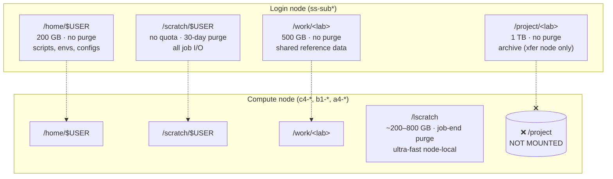

# Storage topology

Five filesystems, five different rulesets. Pick the wrong one and you'll either blow a quota, lose data to a 30-day purge, or hit an unmountable path mid-job.



## Quick reference

| Path | Quota | Purged | Use for |
|---|---|---|---|
| `/home/$USER` | 200 GB | Never | Scripts, conda envs, configs — changes slowly |
| `/scratch/$USER` | No quota | **30 days** | ALL job I/O — inputs, outputs, intermediates |
| `/work/<lab>` | 500 GB | Never | Shared reference data (genomes, annotations) |
| `/project/<lab>` | 1 TB | Never | Archive — **xfer node only**, not mountable on compute |
| `/lscratch` | ~200–800 GB | Job end | Ultra-fast node-local I/O for single-node jobs |

## Rules

!!! danger "`/project` is not mountable on compute nodes"
    A job that tries to read from `/project` fails. Move data to `/scratch` on the xfer node *before* the job runs.

!!! warning "`/scratch` purges at 30 days — no warning"
    `touch` important files weekly to reset the clock, or move outputs to `/work` or `/project` after jobs finish. Reset in bulk:
    ```bash
    find /scratch/$USER/important_dir -exec touch {} +
    ```

!!! warning "`/lscratch` disappears when the job ends"
    Copy results back to `/scratch` in the last step of the sbatch script, before the job exits.

!!! tip "`/lscratch` is free performance"
    For I/O-bound single-node jobs (aligners writing intermediate SAMs, databases loading into memory), staging inputs onto `/lscratch` and copying results out at the end can halve wall-time.

## Staging pattern for `/lscratch`

```bash
#!/bin/bash
#SBATCH --job-name=aln
#SBATCH --gres=lscratch:200    # reserve 200 GB local
# ... other SBATCH headers ...

STAGE=/lscratch/$SLURM_JOB_ID
OUT=/scratch/$USER/results

cp /work/<lab>/genome/* $STAGE/
cd $STAGE

# run the job against $STAGE, not /scratch directly
aligner --ref $STAGE/genome.fa --reads $STAGE/reads.fq.gz -o $STAGE/out.bam

# copy results back before the job exits
cp $STAGE/out.bam $OUT/
```
